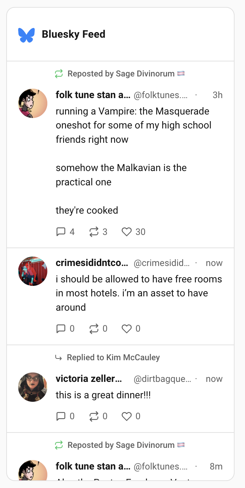

# Bluesky Feed for Home Assistant



A custom Home Assistant integration that displays your Bluesky social feed as a Lovelace dashboard card. Supports your home timeline, a specific user's posts, or any custom feed.

## Features

- View your Bluesky timeline, a user's posts, or a custom feed directly in Home Assistant
- Rich card rendering: avatars, images with lightbox, link previews, quoted posts, reply indicators, repost attribution
- Interactive like and repost buttons with optimistic UI
- Configurable card appearance (title, icon, max posts, max height, image and metric toggles)
- Configurable poll interval (30s--3600s) and post limit (1--50)

## Requirements

- Home Assistant 2024.1 or later
- A Bluesky account with an [App Password](https://bsky.app/settings/app-passwords)

## Installation

### HACS (Recommended)

1. Open HACS in your HA instance
2. Go to **Integrations** > three-dot menu > **Custom repositories**
3. Add `https://github.com/PersephoneKarnstein/ha-bluesky-feed` with category **Integration**
4. Search for "Bluesky Feed" and install
5. Restart Home Assistant

### Manual

1. Copy the `custom_components/bluesky_feed` directory into your Home Assistant `config/custom_components/` directory. The final structure should be:

   ```
   config/
     custom_components/
       bluesky_feed/
         __init__.py
         config_flow.py
         const.py
         coordinator.py
         manifest.json
         sensor.py
         services.yaml
         strings.json
         translations/
           en.json
         www/
           bluesky-feed-card.js
   ```

2. Restart Home Assistant.

## Configuration

### Adding the integration

1. Go to **Settings > Devices & Services > Add Integration**.
2. Search for **Bluesky Feed**.
3. Enter your Bluesky handle (e.g. `yourname.bsky.social`) and an [App Password](https://bsky.app/settings/app-passwords). Do **not** use your account password.
4. Choose a feed type:
   - **Following** -- your home timeline
   - **Specific User's Posts** -- enter any user's handle
   - **Custom Feed URL** -- enter an AT URI for a custom feed (e.g. `at://did:plc:.../app.bsky.feed.generator/...`)
5. Set the poll interval (default 300s) and post limit (default 20).

You can add the integration multiple times for different feeds. The poll interval and post limit can be changed later under the integration's **Configure** button.

### Adding the card

The card registers itself automatically -- no manual resource registration is needed.

1. Open a dashboard and enter edit mode.
2. Click **Add Card** and search for **Bluesky Feed Card**.
3. Select the sensor entity created by the integration.
4. Configure the card options:

| Option | Default | Description |
|---|---|---|
| Entity | *(required)* | The Bluesky Feed sensor entity |
| Card Title | `Bluesky Feed` | Header text. Leave empty to hide the header. |
| Icon | `mdi:butterfly-outline` | Header icon. Clear both title and icon to remove the header entirely. |
| Max posts to display | `20` | Number of posts shown in the card |
| Max card height | `600px` | Any CSS height value, or leave empty for no limit |
| Show images | `true` | Display image attachments inline |
| Show engagement metrics | `true` | Display reply, repost, and like counts |
| Repost button action | `Repost directly` | What happens when you click the repost icon: repost via the API, or open a quote compose page on bsky.app |

### Card YAML example

```yaml
type: custom:bluesky-feed-card
entity: sensor.bluesky_following
title: Bluesky Feed
icon: mdi:butterfly-outline
max_posts: 20
max_height: 600px
show_images: true
show_metrics: true
repost_action: repost
```

## Interactions

When `show_metrics` is enabled, the like and repost buttons are interactive:

- **Like**: Click the heart to like a post. Click again to unlike. The count updates immediately (optimistic UI) and calls the Bluesky API in the background.
- **Repost**: Behavior depends on the `repost_action` card setting:
  - `repost` -- toggles a repost via the API (click again to undo)
  - `quote` -- opens `bsky.app/intent/compose` in a new tab with the post pre-filled as a quote

Clicking anywhere else on a post opens it on bsky.app in a new tab.

## Services

The integration registers four services you can call from automations or scripts:

### `bluesky_feed.like`

Like a post. Returns the like record URI.

| Field | Description |
|---|---|
| `entity_id` | The Bluesky Feed sensor entity |
| `uri` | AT URI of the post |
| `cid` | CID of the post |

### `bluesky_feed.unlike`

Remove a like.

| Field | Description |
|---|---|
| `entity_id` | The Bluesky Feed sensor entity |
| `record_uri` | AT URI of the like record (returned by `bluesky_feed.like`) |

### `bluesky_feed.repost`

Repost a post. Returns the repost record URI.

| Field | Description |
|---|---|
| `entity_id` | The Bluesky Feed sensor entity |
| `uri` | AT URI of the post |
| `cid` | CID of the post |

### `bluesky_feed.unrepost`

Remove a repost.

| Field | Description |
|---|---|
| `entity_id` | The Bluesky Feed sensor entity |
| `record_uri` | AT URI of the repost record (returned by `bluesky_feed.repost`) |

## Sensor attributes

The sensor entity exposes these attributes:

- `posts` -- array of post objects, each containing author info, text, facets, images, external links, quoted posts, reply metadata, engagement counts, and viewer interaction state (`viewer_like`, `viewer_repost`)
- `feed_type` -- `timeline`, `author`, or `custom`

The sensor's state value is the number of posts currently loaded.

## Troubleshooting

- **Card not appearing in the card picker**: Restart Home Assistant after installing the files. The card JS is served from a static path registered at startup.
- **Authentication errors in logs**: Regenerate your App Password at [bsky.app/settings/app-passwords](https://bsky.app/settings/app-passwords). Do not use your main account password.
- **Stale data**: The feed updates on the configured poll interval. You can adjust this in the integration's options (Settings > Devices & Services > Bluesky Feed > Configure).
- **Like/repost not persisting visually after page reload**: The card relies on `viewer_like`/`viewer_repost` data from the Bluesky API. These fields update on the next coordinator poll cycle.
